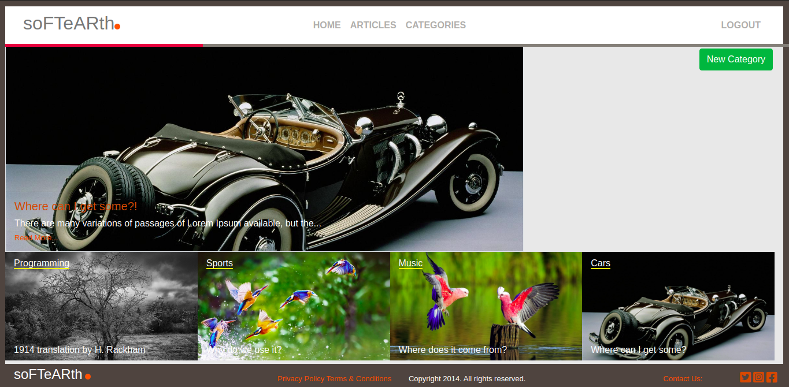
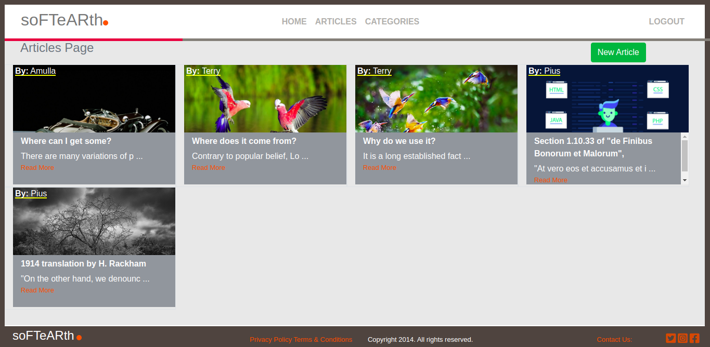

## Ruby on Rails Capstone (Lifestyle Article).[Solo Project]

### Articles Blog Description
This Project is mainly based on posting and voting articles. The article with the highest number of votes is displayed as the main article on the home page. An article belongs to various categories and vice-versa. A logged user can only vote an article once. This [ERD](https://app.lucidchart.com/documents/edit/b0da518b-23c4-459e-9306-2d5ee71471bf/0_0?beaconFlowId=1BFEDD3F9F8A9DD6#?folder_id=home&browser=icon) diagram demonstrates the association among the various models used in the application

## Built With
This project development was achieved using the following technologies:

- Ruby on Rails,
- Bootstrap and CSS
- Rspec

## Live Demo

[Live Demo Link](https://ancient-temple-19036.herokuapp.com/)

## Home Page of the Application

## Articles Page

## Getting Started

To get a local copy up and running follow these simple example steps.

### Prerequisites

#### You should have installed git on your local machine and a text editor of your choice.
### Setup

- Forking the project-Repository
- Cloning the project to your local machine
- `cd` into the project directory
- Run `bundle install` to install the Gemfiles
- Run `db:migrate` to install the Gemfiles
- From the root directory, run `rails server` to start the Project on `localhost:3000`

## Usage section

- Sign Up in the application and create categories
- Continue and also create an article.
- Assign an article a category
- Upvote an article and notice that it takes the bigger section on the home page.
- When through, Log out of the application and you will notice that other users can also view the     created articles but cannot create their own unless they sign up 

## Checking the tests with RSpec
The tests for the model and controllers was implemented using RSpec gem. To execute these test cases, run `bundle exec rspec ` to display the test cases of the application. 

## Author

👤 **Author**

- Github: [@OdongAlican](https://github.com/OdongAlican)
- Twitter: [@odongsandie](https://twitter.com/odongsandie)
- Linkedin: [Sunday Alican odong](https://www.linkedin.com/in/sunday-alican-odong-b99226b7)

## 🤝 Contributing

Contributions, issues and feature requests are welcome! Start by:

- Forking the project
- Cloning the project to your local machine
- `cd` into the project directory
- Run `git checkout -b your-branch-name`
- Make your contributions
- Push your branch up to your forked repository
- Open a Pull Request with a detailed description to the development branch of the original project for a review

## Credits

Thanks to [Nelson Sakwa and others on Behance](https://www.behance.net/sakwadesignstudio) for his awesome design work. I based my work on  [this](https://www.behance.net/gallery/14554909/liFEsTlye-Mobile-version) design.

## Show your support

Give a ⭐️ if you like this project!

Feel free to check the [issues page](issues/).

## Show your support

Give a ⭐️ if you like this project!

## Acknowledgments

- Appreciation to my coding Partner and mentor

## 📝 License

This project is [MIT](lic.url) licensed.
